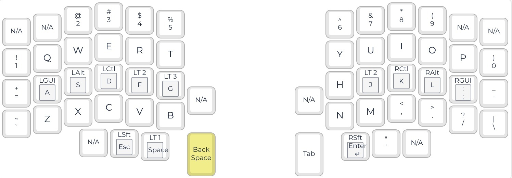
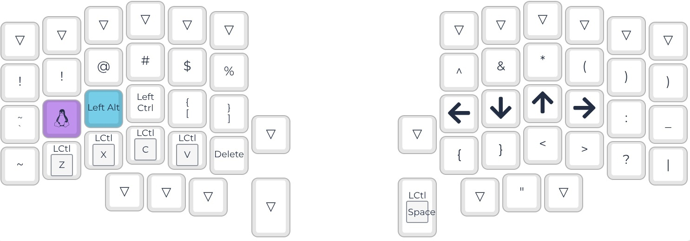
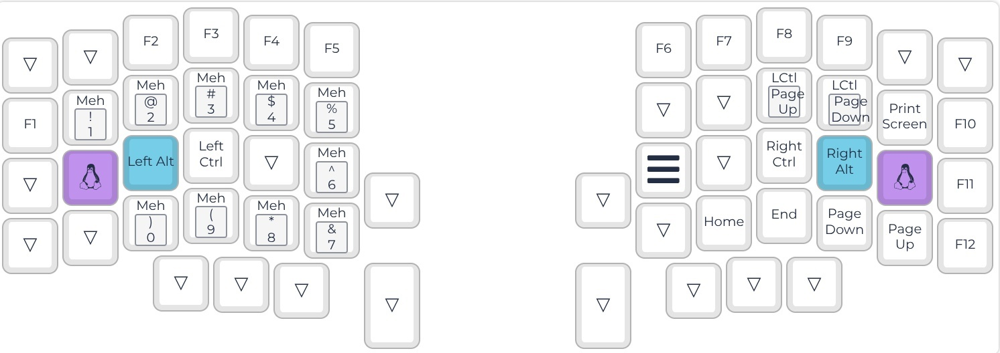
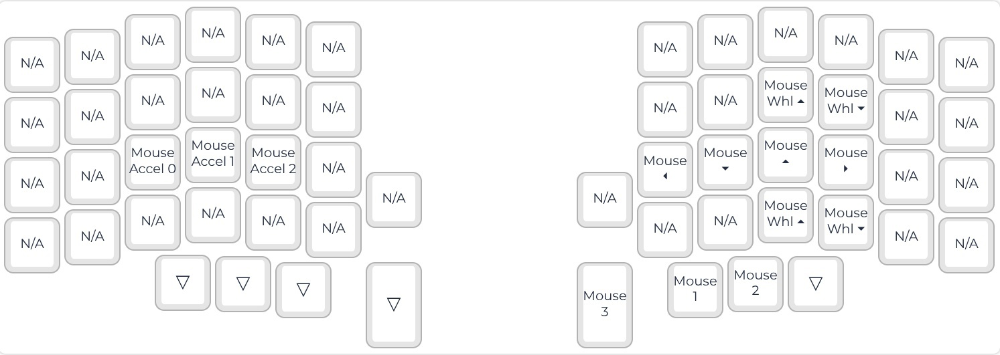

# KM50
## 50键分体键盘KeyMap
比较适用于编程，各手指分配均匀，尤其是大拇指，左右各只有一个常用Mod键  

## 特点
### 1、保留数字键，并将1和0移到小指的侧上方
数字键比较常用，常规布局最难按的就是0和9,我之前都是用无名指按，别扭且易错，把0和9放到小指侧上方距离1.5个键位，变得很容易按并且准确
### 2、Home-Mod键，但排除shift
Home-Mod键很好用，尤其是编程需要用到大量组合键
### 3、右手大拇指shift
shift键大部分时间用于大写输入，而Alt、Ctrl、Win只会用于组合键，在快速输入时，Home-Mod shift键非常容易出错，因此将shift键移到右手大拇指,并且设置HOLD_ON_OTHER_KEY_PRESS，这样可以完全杜绝错误发生
### 4、左手非对称shift
左手大拇指home键位并没有设置shift, 因为右手大拇指按住shift时，右手其他4指受影响不大，在左手大拇指home左边键位增加shift,填补shift+enter
### 5、重新排布符号键
将编程使用频率很高的+-=_，放到小拇指两侧，其他一些需要按shift的符号，增加到第2层
### 6、对称Home-Mod Fn层
很方便地实现Ctrl+Shift+Alt+Win+F1组合键
### 7、Fn层大量自定按键
Ctrl+Shift+Alt+Num实现切换到指定App, Ctrl+PageUp实现左右标签页切换,等等
